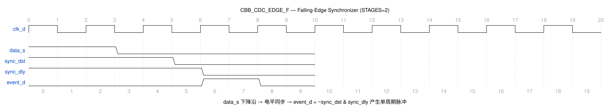

# CBB_CDC_EDGE_F_UG

---

## 目录

- [1. 功能及应用场景](#1-功能及应用场景)
- [2. 规格](#2-规格)
- [3. 方案分析](#3-方案分析)
- [4. 配置参数](#4-配置参数)
- [5. 接口](#5-接口)
- [6. 时序图](#6-时序图)
- [7. PPA](#7-ppa)

---

## 1. 功能及应用场景

`cbb_cdc_edge_f` 是一个**下降沿同步器（Falling-Edge Synchronizer）**，对应标准 CDC 电路16（电平同步器 + 下降沿检测）。将源时钟域的 `data_s` 电平信号同步到目标时钟域，并在目标时钟域检测其下降沿（1→0 跳变），输出 1 个 `clk_d` 时钟周期宽度的单周期脉冲 `event_d`。

**核心功能：**

- 采用两级（STAGES 级）目标域 DFF 对 `data_s` 进行电平同步，消除亚稳态
- 在目标域通过"上一拍同步值取反 & 当前同步值"的组合逻辑提取下降沿
- 输出 1 个 `clk_d` 周期宽度的单周期脉冲
- STAGES 参数化可配置，默认 2 级
- 支持多工艺平台：`TSMC_12` / `FPGA_XILINX` / `FPGA_ALTERA` / 默认 RTL

**适用场景：**

**信号类型：** 单 bit 电平信号（位宽固定为 1）。仅支持单 bit 信号跨时钟域同步，不适用于多 bit 数据总线场景。

**时钟域场景：**
- **慢时钟域 → 快时钟域（推荐）：** 目标时钟频率 ≥ 源时钟频率时，同步链可充分采样源信号，亚稳态概率最低。`data_s` 每产生一次 1→0 跳变，目标域在 STAGES+1 个 `clk_d` 周期后输出 1 个 `clk_d` 周期宽度的脉冲 `event_d`。
- **快时钟域 → 慢时钟域（受限）：** 需保证 `data_s` 低电平宽度 ≥ 1 个 `clk_d` 周期，否则目标域可能漏采跳变。当目标时钟频率远低于源时钟频率时，`data_s` 低电平保持时间须相应增大，建议频率比 f_src/f_dst ≤ 1/(2×STAGES) 以确保可靠检测。

**设计限制：** 输出 `event_d` 为单周期脉冲，宽度恒为 1 个 `clk_d` 周期，与源域 `data_s` 的脉冲宽度无关。两次 `data_s` 跳变的最小间隔须 ≥ (STAGES+1) 个 `clk_d` 周期，否则目标域输出脉冲可能重叠。

**典型应用：**
- 源域电平下降沿触发目标域动作
- 使能信号撤销的跨域通知
- 中断清除信号的同步
- 状态机跨域下降沿触发

---

## 2. 规格

**规格汇总：**

| 规格 ID | 类型 | 规格项 | 描述 |
|---------|------|--------|------|
| DS.CBB_CDC_EDGE_F.INTF.001 | INTF | 时钟域 | clk_d 目标域，data_s 来自源域 |
| DS.CBB_CDC_EDGE_F.CFG.001 | CFG | 同步级数 | STAGES ≥2，默认 2 |
| DS.CBB_CDC_EDGE_F.CFG.002 | CFG | 工艺选择 | TSMC_12/FPGA_XILINX/FPGA_ALTERA/RTL |
| DS.CBB_CDC_EDGE_F.FUNC.001 | FUNC | 下降沿检测 | 检测 data_s 1→0 跳变 |
| DS.CBB_CDC_EDGE_F.FUNC.002 | FUNC | 单周期脉冲 | 1 个 clk_d 周期脉冲 |
| DS.CBB_CDC_EDGE_F.PERF.001 | PERF | 同步延迟 | STAGES+1 个 clk_d 周期 |
| DS.CBB_CDC_EDGE_F.PERF.002 | PERF | MTBF | 2 级典型 >10^9 年 |

### 2.1 下降沿检测与脉冲输出 — DS.CBB_CDC_EDGE_F.FUNC.001

`data_s` 经两级目标域 DFF 电平同步得到 `sync_dst`，目标域再打一拍得到 `sync_dly`，通过 `event_d = ~sync_dst & sync_dly` 提取下降沿。`data_s` 每个 1→0 跳变在目标域产生 1 个 `clk_d` 周期宽度的脉冲。

### 2.2 单周期脉冲输出 — DS.CBB_CDC_EDGE_F.FUNC.002

`event_d` 为目标域单周期脉冲，宽度恒为 1 个 `clk_d` 周期，与源域 `data_s` 的脉冲宽度无关。

### 2.3 同步级数可配置 — DS.CBB_CDC_EDGE_F.CFG.001

同步寄存器链级数 STAGES 可参数化配置，范围为 >= 2，默认值 2。Elaboration 阶段自动校验，STAGES < 2 时报 `$error` 拦截。

### 2.4 工艺选择 — DS.CBB_CDC_EDGE_F.CFG.002

通过宏定义选择同步器工艺实现：`TSMC_12`（SDFSYNCNQD）、`FPGA_XILINX`（FDCE）、`FPGA_ALTERA`（dffeas）、默认 RTL 行为级描述。

### 2.5 时钟域 — DS.CBB_CDC_EDGE_F.INTF.001

仅包含目标域时钟 `clk_d`。`data_s` 为源域产生的电平信号，在目标域完成电平同步与边沿检测，无需源域时钟。

### 2.6 同步延迟 — DS.CBB_CDC_EDGE_F.PERF.001

同步延迟 = STAGES + 1 个 `clk_d` 周期（STAGES 级电平同步 + 1 级边沿检测打拍）。STAGES=2 时延迟为 3 个 `clk_d` 周期。

### 2.7 MTBF — DS.CBB_CDC_EDGE_F.PERF.002

MTBF 随 STAGES 指数级提升。2 级同步器在典型工艺条件下（100MHz 目标时钟）MTBF > 10^9 年。

---

## 3. 方案分析

### 3.1 电路结构

边沿同步器（电路16）的机制是：先用电平同步器（两级 DFF）将源信号同步到目标时钟域，再在目标时钟域进行下降沿检测。电平同步保证跨域采样的亚稳态被净化，边沿检测在目标域完成，避免在源域直接检测边沿时因时钟频率差异漏采。

**实现方法对比：**

| 方法 | 优点 | 缺点 | 选用 |
| ---- | ---- | ---- | ---- |
| 源域检测边沿 + 电平同步 | 逻辑简单 | 需源域时钟，窄脉冲可能漏采 | 否 |
| 电平同步 + 目标域边沿检测 | 结构规整，仅需目标域时钟 | 需保证源电平宽度足够 | **是** |

### 3.2 实现方案

**电路结构图：**

```
  data_s ──→ sync_reg[0] ──→ sync_reg[1] ──→ ... ──→ sync_dst
                 (clk_d)        (clk_d)                  │
                                                             ├──→ sync_dly (clk_d, 打一拍)
                                                             │
                       event_d = ~sync_dst & sync_dly
```

**工作原理：**

1. **电平同步**：`data_s` 进入目标时钟域，经 STAGES 级 DFF（`sync_reg`）逐级净化亚稳态，末级输出 `sync_dst`
2. **边沿检测**：`sync_dst` 再打一拍得到 `sync_dly`，`event_d = ~sync_dst & sync_dly` 检测 `sync_dst` 的 1→0 跳变
3. **脉冲输出**：`sync_dst` 下降沿当拍 `event_d` 为 1，下一拍 `sync_dly` 追上 `sync_dst` 后 `event_d` 回 0，形成 1 个 `clk_d` 周期宽度的脉冲

---

## 4. 配置参数

| 参数 | 配置范围 | 默认值 | 描述 |
| ---- | -------- | ------ | ---- |
| STAGES | >= 2 | 2 | 同步寄存器链级数。影响 MTBF 和同步延迟 |

---

## 5. 接口

| 信号名 | 位宽 | I/O | 时钟域 | 描述 |
| ------ | ---- | --- | ------ | ---- |
| clk_d    | 1 | I | dst | 目标域工作时钟，上升沿有效 |
| rst_d_n  | 1 | I | dst | 目标域异步复位，低有效 |
| init_d_n | 1 | I | dst | 目标域同步复位，低有效 |
| data_s   | 1 | I | src | 源域电平信号，下降沿触发目标域脉冲 |
| event_d  | 1 | O | dst | 目标域下降沿脉冲，高有效，1 个 clk_d 周期宽 |
| test     | 1 | I | -   | 测试模式使能 |

---

## 6. 时序图

### 6.1 典型时序



- 源域 `data_s` 出现 1→0 跳变（异步于 `clk_d`）
- 经 STAGES 级电平同步后，`sync_dst` 稳定为 0
- `sync_dly` 为 `sync_dst` 延迟一拍
- `event_d = ~sync_dst & sync_dly` 在 `sync_dst` 下降沿产生单周期脉冲
- 上升沿期间 `~sync_dst & sync_dly` 不检出，不产生脉冲

---

## 7. PPA

> **综合工具：** Synopsys DC Ultra W-2024.09-SP3
> **工艺库：** TSMC 12nm tcbn12ffcllbwp7d5t16p96cpd (ssgnp0p9v125c)
> **工艺选择：** TSMC_12（SDFSYNCNQD1BWP7D5T16P96CPD 专用同步单元）

### 7.1 配置A：STAGES=2（默认，5GHz）

**参数设置：**

| 参数 | 设置值 | 说明 |
| ---- | ------ | ---- |
| STAGES | 2 | 2 级同步寄存器链 |

**PPA 数据：**（DC 综合实测）

| 项目 | 数值 |
| ---- | ---- |
| 工艺 | TSMC 12nm (ssgnp0p9v125c) |
| 频率 | 5 GHz |
| 周期 | 200 ps |
| 面积 | 4.838400 µm² |
| 单元数 | 11 cells |
| 功耗 | 41.7447 µW（动态）+ 21.3889 nW（漏电） |
| WNS | +0.082 ns（41% 裕量） |
| TNS | 0.000 ns |
| 违例路径 | 0 |

> **结论：** TSMC 12nm 工艺下，5GHz（200ps 周期）约束下建立时间无违例（WNS=+0.082ns，41% 裕量）。电路结构含 11 个标准单元（含 3 个 SDFSYNCNQD 专用同步单元），面积 4.838400 µm²，动态功耗 41.7447 µW、漏电 21.3889 nW。与 `cbb_cdc_edge_r` 电路结构对称。

---
