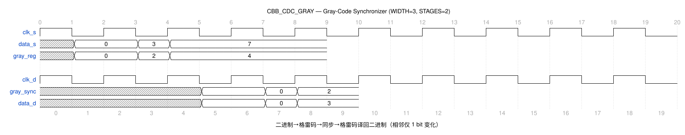

# CBB_CDC_GRAY_UG

---

## 目录

- [1. 功能及应用场景](#1-功能及应用场景)
- [2. 规格](#2-规格)
- [3. 方案分析](#3-方案分析)
- [4. 配置参数](#4-配置参数)
- [5. 接口](#5-接口)
- [6. 时序图](#6-时序图)
- [7. PPA](#7-ppa)

---

## 1. 功能及应用场景

cbb_cdc_gray 是一个格雷码同步器（Gray Code Synchronizer），将源域的多 bit 二进制数据经二进制→格雷码转换后通过同步链传到目标域，再经格雷码→二进制逆转换恢复原始数据。利用格雷码每次仅 1 bit 变化的特性，避免多 bit 跨时钟域同步时的数据不一致风险。

**核心功能：**

- 源域二进制数据 `data_s` 经组合逻辑转换为格雷码
- 格雷码经 STAGES 级同步寄存器链（每 bit 独立同步）传递到目标域
- 目标域将同步后的格雷码经组合逻辑恢复为二进制数据 `data_d`
- WIDTH 参数化可配置（1~64），默认 8
- STAGES 参数化可配置（>= 2），默认 2

**适用场景：**

**信号类型：** 多 bit 二进制数据信号（位宽 WIDTH = 1~64，默认 8）。源域二进制数据经格雷码编码后跨时钟域同步，目标域恢复为二进制输出。相邻计数值仅 1 bit 变化，适用于连续递增/递减数据的跨域传输。不适用于任意跳变的多 bit 数据（无相邻限制的数据）或随机数据总线场景。

**时钟域场景：**
- **慢时钟域 → 快时钟域（推荐）：** 目标时钟频率 ≥ 源时钟频率时，同步链可充分采样格雷码的每 bit 变化。`data_s` 的每个值须保持至少 STAGES 个 `clk_d` 周期，同步延迟 = STAGES 个 `clk_d` 周期。
- **快时钟域 → 慢时钟域（受限）：** 需保证 `data_s` 的每个格雷码值保持时间 ≥ STAGES 个 `clk_d` 周期，否则同步链可能采样到多位同时跳变的中间状态。当目标时钟频率远低于源时钟频率时，源域数据更新速率须相应降低，建议频率比 f_src/f_dst ≤ 1/STAGES。

**设计限制：**
- **数据更新限制：** `data_s` 须按格雷码序列更新（相邻值仅 1 bit 变化），每个值须保持至少 STAGES 个 `clk_d` 周期。
- **位宽范围：** WIDTH 可配置为 1~64，默认 8。WIDTH 应配置为与源域二进制数据位宽一致。
- 格雷码编码保证相邻值仅 1 bit 变化，从根本上消除多 bit 同步中的亚稳态累积风险。

**典型应用：**
- 多 bit 计数器值跨域传输（如 FIFO 读写指针同步）
- 状态机状态码跨域传递
- 连续递增/递减数据的跨时钟域同步
- 需要传输多 bit 数据但不适用握手协议的场景

---

## 2. 规格

**规格汇总：**

| 规格 ID | 类型 | 规格项 | 描述 |
|---------|------|--------|------|
| DS.CBB_CDC_GRAY.INTF.001 | INTF | 双时钟域接口 | clk_s/clk_d 独立时钟域 |
| DS.CBB_CDC_GRAY.CFG.001 | CFG | 数据位宽 | WIDTH 1~64，默认 8 |
| DS.CBB_CDC_GRAY.CFG.002 | CFG | 同步级数 | STAGES ≥2，默认 2 |
| DS.CBB_CDC_GRAY.CFG.003 | CFG | 工艺选择 | TSMC_12/FPGA_XILINX/FPGA_ALTERA/RTL |
| DS.CBB_CDC_GRAY.FUNC.001 | FUNC | 格雷码转换 | 二进制↔格雷码双向转换 |
| DS.CBB_CDC_GRAY.FUNC.002 | FUNC | 单 bit 变化 | 相邻值仅 1 bit 变化 |

### 2.1 数据位宽可配置 — DS.CBB_CDC_GRAY.CFG.001

数据位宽 WIDTH 可参数化配置，范围为 1~64，默认值 8。WIDTH 应配置为与源域二进制数据位宽一致。

### 2.2 同步级数可配置 — DS.CBB_CDC_GRAY.CFG.002

同步寄存器链级数 STAGES 可参数化配置，范围为 >= 2，默认值 2。源域 `data_s` 须按格雷码序列更新（相邻值仅 1 bit 变化），且每个值须保持至少 STAGES 个 `clk_d` 周期，否则同步链可能采样到多位同时跳变的中间状态。

### 2.3 工艺选择 — DS.CBB_CDC_GRAY.CFG.003

通过宏定义选择同步器工艺实现：`TSMC_12`（SDFSYNCNQD）、`FPGA_XILINX`（FDCE）、`FPGA_ALTERA`（dffeas）、默认 RTL 行为级描述。

### 2.4 二进制→格雷→同步→二进制恢复 — DS.CBB_CDC_GRAY.FUNC.001

源域二进制数据首先转换为格雷码（`gray = binary ^ {1'b0, binary[MSB:1]}`），经同步链传递后，目标域将格雷码恢复为二进制（从 MSB 到 LSB 逐位 `binary[i] = binary[i+1] ^ gray[i]`），实现完整的数据跨域传输。

### 2.5 单 bit 变化保证 — DS.CBB_CDC_GRAY.FUNC.002

格雷码相邻值之间仅 1 bit 发生变化。因此即使同步链中不同 bit 的延迟有差异，采样到的也最多是相邻两个值之一，不会出现完全错误的中间值。

### 2.6 双时钟域接口 — DS.CBB_CDC_GRAY.INTF.001

接口包含独立的源域时钟 `clk_s` 和目标域时钟 `clk_d`。源域 `data_s` 在 `clk_s` 域完成二进制→格雷码转换，同步链运行在 `clk_d` 域，目标域 `data_d` 经格雷码→二进制组合逻辑输出。

---

## 3. 方案分析

### 3.1 电路结构

多 bit 数据跨时钟域同步的难点在于：不同 bit 路径的延迟不一致，可能导致目标域采样到多位同时跳变的中间状态，产生完全错误的数据值。

**实现方法对比：**

| 方法         | 优点                             | 缺点                           | 选用         |
| ------------ | -------------------------------- | ------------------------------ | ------------ |
| 多 bit 直连  | 零延迟，无额外逻辑               | 多位同时跳变，数据可能完全错误  | 否           |
| DMUX 握手    | 数据绝对正确，支持任意位宽       | 延迟大，需要握手往返           | 否           |
| 格雷码同步   | 每次仅 1 bit 变化，数据最多偏差1 | 仅适用于连续递增/递减数据      | **是**       |

本设计利用格雷码的**相邻值仅 1 bit 不同**特性：

1. 源域二进制数据首先通过组合逻辑转换为格雷码：`gray = binary ^ {1'b0, binary[MSB:1]}`
2. 格雷码每位独立经过 STAGES 级同步寄存器链传递到目标域
3. 即使同步链中各位到达时间有差异（skew），目标域采样到的要么是旧值、要么是新值，不会出现错误的中间值
4. 目标域通过组合逻辑恢复二进制：MSB 不变，从 MSB-1 到 LSB 逐位 `binary[i] = binary[i+1] ^ gray[i]`

### 3.2 实现方案

**电路结构图：**

```
                      clk_s 域                              clk_d 域
                      ┌─────────────────────┐    ┌────────────────────────────────┐
                      │                     │    │                                │
  data_s[W-1:0] ──→│  Bin2Gray (组合逻辑) │    │  gray_sync[STAGES-1][W-1:0]    │
                      │  gray = bin ^       │    │  (STAGES x WIDTH DFFs)         │
                      │  {1'b0, bin[W-1:1]} │    │           │                    │
                      │         │           │    │      gray_sync (末级)          │
                      │    gray_reg[W-1:0]  │    │           │                    │
                      │      (寄存器输出)    │───→│  Gray2Bin (组合逻辑)            │
                      │                     │    │  bin[MSB] = gray[MSB]          │
                      │                     │    │  bin[i] = bin[i+1] ^ gray[i]  │
                      │                     │    │           │                    │
                      └─────────────────────┘    │      data_d[W-1:0]           │
                                                  │      (组合输出)                 │
                                                  └────────────────────────────────┘
```

**工作原理：**

1. **二进制→格雷码转换（源域）**：在 `clk_s` 上升沿，`data_s` 经组合逻辑 `gray = data_s ^ {1'b0, data_s[WIDTH-1:1]}` 转换为格雷码，并寄存器输出 `gray_reg`
2. **格雷码同步（跨域）**：`gray_reg` 的每位（WIDTH 位）各自独立经过 STAGES 级 DFF 链（运行在 `clk_d` 域）同步到目标域。因为相邻格雷码值仅 1 bit 变化，不存在多位同时跳变的采样风险
3. **格雷码→二进制恢复（目标域）**：同步后的 `gray_sync` 经组合逻辑恢复二进制：`bin[MSB] = gray[MSB]`，`bin[i] = bin[i+1] ^ gray[i]`（从 MSB-1 递减到 0），组合输出为 `data_d`
4. **延迟分析**：从 `data_s` 更新到 `data_d` 稳定，延迟 = 1 个 `clk_s` 周期（Bin2Gray 寄存器）+ STAGES 个 `clk_d` 周期（同步链），目标域不再额外打拍

---

## 4. 配置参数

| 参数   | 配置范围 | 默认值 | 描述                                           |
| ------ | -------- | ------ | ---------------------------------------------- |
| WIDTH  | 1 ~ 64   | 8      | 数据位宽                                       |
| STAGES | >= 2     | 2      | 同步寄存器链级数。影响 MTBF 和同步延迟         |

---

## 5. 接口

| 信号名    | 位宽          | I/O | 时钟域 | 描述                                   |
| --------- | ------------- | --- | ------ | -------------------------------------- |
| clk_s   | 1             | I   | src    | 源域时钟，上升沿有效                   |
| clk_d   | 1             | I   | dst    | 目标域时钟，上升沿有效                 |
| rst_s_n | 1             | I   | src    | 源域异步复位，低有效                   |
| init_s_n| 1             | I   | src    | 源域同步复位，低有效                   |
| rst_d_n | 1             | I   | dst    | 目标域异步复位，低有效                 |
| init_d_n| 1             | I   | dst    | 目标域同步复位，低有效                 |
| data_s  | WIDTH         | I   | src    | 源域二进制数据                         |
| data_d  | WIDTH         | O   | dst    | 目标域同步后的二进制数据（组合输出）   |
| test    | 1             | I   | -      | 测试模式使能                           |

---

## 6. 时序图

### 6.1 典型时序



- 源域 `data_s` 更新为新值（如从 0x03 → 0x04），在 `clk_s` 上升沿完成 Bin2Gray 转换，`gray_reg` 仅 1 bit 变化
- `gray_reg` 各 bit 经 STAGES 级 `clk_d` 同步链传递，总延迟 = STAGES 个 `clk_d` 周期
- 目标域 `gray_sync` 稳定后，经 Gray2Bin 组合逻辑直接输出，`data_d` 更新为与 `data_s` 一致的值
- 由于格雷码特性，同步过程中不会出现非预期的中间值（最多为新旧值之一）

---

## 7. PPA

> **综合工具：** Synopsys DC Ultra W-2024.09-SP3
> **工艺库：** TSMC 12nm tcbn12ffcllbwp7d5t16p96cpd (ssgnp0p9v125c)
> **时钟约束：** 0.204ns (4.9GHz)

### 7.1 配置A：WIDTH=8, STAGES=2（默认）

**参数设置：**

| 参数   | 设置值 | 说明               |
| ------ | ------ | ------------------ |
| WIDTH  | 8      | 8 bit 数据位宽     |
| STAGES | 2      | 2 级同步寄存器链   |

**PPA 数据：**（DC 综合实测）

| 项目   | 数值                     |
| ------ | ------------------------ |
| 频率   | 4.9 GHz                  |
| 面积   | 51.932160 µm²               |
| 单元数 | 83 cells                 |
| 功耗   | 397.9966 µW（动态）+ 358.8650 nW（漏电） |
| WNS    | +0.001288 ns（4.9GHz 0违例）       |

> **结论：** 0.204ns 周期约束下建立时间无违例，WNS=+0.001288ns，能满足 4.9GHz 目标。STAGES=2、WIDTH=8 时寄存器用量 = 8（Bin2Gray 寄存器 DFCNQD）+ 16（同步链 2x8 SDFSYNCNQD）+ 组合逻辑（Gray2Bin AO22/OAI21/XNR），目标域不再额外寄存。实测面积 51.932160 µm²（83 cells），动态功耗 397.9966 µW、漏电 358.8650 nW，4.9GHz 时序收敛 0 违例。

---
