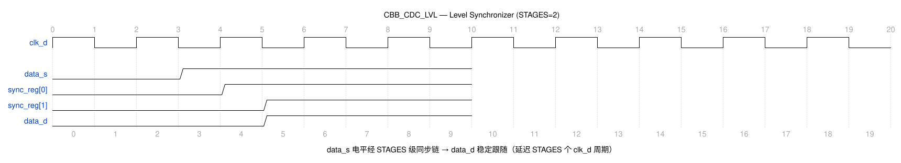

# CBB_CDC_LVL_UG

---

## 目录

- [1. 功能及应用场景](#1-功能及应用场景)
- [2. 规格](#2-规格)
- [3. 方案分析](#3-方案分析)
- [4. 配置参数](#4-配置参数)
- [5. 接口](#5-接口)
- [6. 时序图](#6-时序图)
- [7. PPA](#7-ppa)

---

## 1. 功能及应用场景

cbb_cdc_lvl 是一个电平-电平同步器（Level Synchronizer），将源时钟域的 1bit 电平信号通过多级寄存器链传递到目标时钟域，消除异步跨域带来的亚稳态风险。所有同步寄存器均运行在目标时钟域，逐级"净化"输入信号。

**核心功能：**

- 将 1bit 异步电平信号通过 STAGES 级 D 触发器链传递到目标时钟域
- 通过多级寄存器串联，逐级降低亚稳态传播概率，提高 MTBF
- STAGES 参数化可配置，默认 2 级，支持 >= 2 的任意级数
- 支持多工艺平台：`TSMC_12` / `FPGA_XILINX` / `FPGA_ALTERA` / 默认 RTL

**适用场景：**

**信号类型：** 单 bit 电平信号（位宽固定为 1）。仅支持单 bit 信号跨时钟域同步，不适用于多 bit 数据总线场景。

**时钟域场景：**
- **慢时钟域 → 快时钟域（推荐）：** `data_s` 电平变化经 STAGES 个 `clk_d` 周期后稳定输出 `data_d`。目标时钟频率 ≥ 源时钟频率时，同步链可充分采样源信号，亚稳态概率最低，同步延迟 = STAGES 个 `clk_d` 周期。
- **快时钟域 → 慢时钟域（受限）：** 需保证 `data_s` 两次电平变化之间的最小间隔 ≥ STAGES 个 `clk_d` 周期，否则目标域可能漏采跳变。当目标时钟频率远低于源时钟频率时，信号变化频率须相应降低，建议频率比 f_src/f_dst ≤ 1/STAGES。

**典型应用：**
- 控制信号（使能、复位释放、模式选择）跨时钟域
- 配置寄存器信号（无高频翻转）跨时钟域
- 中断使能、状态标志等非频繁变化信号
- 需要在两个不同时钟域间传递的单 bit 电平信号

---

## 2. 规格

**规格汇总：**

| 规格 ID | 类型 | 规格项 | 描述 |
|---------|------|--------|------|
| DS.CBB_CDC_LVL.INTF.001 | INTF | 时钟域 | clk_d 目标域，data_s 来自源域 |
| DS.CBB_CDC_LVL.CFG.001 | CFG | 同步级数 | STAGES ≥2，默认 2 |
| DS.CBB_CDC_LVL.CFG.002 | CFG | 工艺选择 | TSMC_12/FPGA_XILINX/FPGA_ALTERA/RTL |
| DS.CBB_CDC_LVL.FUNC.001 | FUNC | 复位状态 | 复位后 data_d=0 |
| DS.CBB_CDC_LVL.FUNC.002 | FUNC | 同步跟随 | 输入变化经 STAGES 周期后跟随 |
| DS.CBB_CDC_LVL.PERF.001 | PERF | 同步延迟 | STAGES 个 clk_d 周期 |
| DS.CBB_CDC_LVL.PERF.002 | PERF | MTBF | 2 级典型 >10^9 年 |

### 2.1 同步级数可配置 — DS.CBB_CDC_LVL.CFG.001

同步寄存器链级数 STAGES 可参数化配置，范围为 >= 2，默认值 2。Elaboration 阶段自动校验，STAGES < 2 时报 `$error` 拦截。输入信号 `data_s` 为静态/准静态电平信号，两次变化之间须保持至少 STAGES 个 `clk_d` 周期（默认 STAGES=2 即 2 个目标时钟周期），否则可能被漏采样。

### 2.2 工艺选择 — DS.CBB_CDC_LVL.CFG.002

通过宏定义选择同步器工艺实现：`TSMC_12`（标准单元同步 DFF，SDFSYNCNQD）、`FPGA_XILINX`（FDCE）、`FPGA_ALTERA`（dffeas）、默认 RTL 行为级描述。`.v` 标准单元实现统一归一到 `TSMC_12`，不再使用 `USE_STDCELL`，以消除宏定义冗余。

### 2.3 复位状态 — DS.CBB_CDC_LVL.FUNC.001

复位（`rst_d_n = 0`）后，所有同步寄存器输出为 0，`data_d` 保持为 0。

### 2.4 同步跟随 — DS.CBB_CDC_LVL.FUNC.002

输入信号 `data_s` 电平变化后，经过 STAGES 个目标时钟周期后，`data_d` 稳定跟随。

### 2.5 同步延迟 — DS.CBB_CDC_LVL.PERF.001

同步延迟 = STAGES 个目标时钟周期。STAGES=2 时延迟为 2 个 `clk_d` 周期。

### 2.6 MTBF — DS.CBB_CDC_LVL.PERF.002

MTBF 随 STAGES 指数级提升。2 级同步器在典型工艺条件下（100MHz 目标时钟，ts = 0.1ns，tau = 50ps）MTBF > 10^9 年。

### 2.7 时钟域 — DS.CBB_CDC_LVL.INTF.001

仅包含目标域时钟 `clk_d`。`data_s` 为源域产生的电平信号，在目标域完成电平同步，无需源域时钟。

---

## 3. 方案分析

### 3.1 电路结构

异步时钟域间直接传递信号可能因建立/保持时间违例导致触发器进入亚稳态，输出不确定值，引发系统错误。电平同步器通过级联多级 D 触发器，将第一级可能产生的亚稳态逐级"净化"，使最终输出稳定可靠。

**实现方法对比：**

| 方法         | 优点                             | 缺点                       | 选用         |
| ------------ | -------------------------------- | -------------------------- | ------------ |
| DMUX 握手    | 无亚稳态风险，支持任意位宽       | 需要握手往返，延迟大       | 否           |
| 格雷码同步   | 多 bit 安全同步，延迟可控        | 仅适用于连续递增/递减数据  | 否           |
| 多级 DFF 链  | 结构简单，延迟可预测，面积小     | 仅适用于单 bit 信号        | **是**       |

本设计采用**多级 D 触发器串联**方案：

1. 输入信号 `data_s` 进入目标时钟域的第一级 DFF
2. 第一级 DFF 输出可能处于亚稳态，但经过后续级 DFF 逐级"净化"后稳定
3. STAGES 级数越多，MTBF 越高，但延迟也相应增加
4. 典型应用 STAGES=2 已满足绝大多数需求，STAGES=3 用于极高可靠性场景

### 3.2 实现方案

**电路结构图：**

```
  data_s ────→ DFF1(U0) ────→ DFF2(U1) ────→ ... DFFn ────→ data_d
                  (clk_d)      (clk_d)           (clk_d)
```

**工作原理：**

1. **第一级 DFF1（U0）**：在 `clk_d` 上升沿采样 `data_s`。由于 `data_s` 与 `clk_d` 异步，可能发生建立/保持时间违例，DFF1 输出可能进入亚稳态（不确定电平）
2. **后续级 DFF2~DFFn**：每一级 DFF 在 `clk_d` 上升沿采样前一级输出。如果前一级处于亚稳态，经过一个完整时钟周期的稳定时间，本级采到的值有极高概率已稳定为有效电平
3. **末级输出**：`data_d` 取自末级同步寄存器，为稳定的同步后电平信号
4. **级数选择**：STAGES=2 为工业标准（双触发器同步器），可满足绝大多数应用。STAGES=3 提供额外裕量，适用于极高可靠性需求或极快时钟场景

---

## 4. 配置参数

| 参数   | 配置范围 | 默认值 | 描述                                           |
| ------ | -------- | ------ | ---------------------------------------------- |
| STAGES | >= 2     | 2      | 同步寄存器链级数。影响 MTBF 和同步延迟         |

---

## 5. 接口

| 信号名      | 位宽 | I/O | 时钟域 | 描述                               |
| ----------- | ---- | --- | ------ | ---------------------------------- |
| clk_d     | 1    | I   | dst    | 目标域工作时钟，上升沿有效         |
| rst_d_n       | 1    | I   | -      | 异步复位，低有效 |
| init_d_n | 1 | I | dst | 目标域同步复位，低有效                    |
| data_s  | 1    | I   | src    | 源域电平信号（在源域时钟域产生）   |
| data_d  | 1    | O   | dst    | 目标域同步后的电平信号（寄存器输出）|
| test | 1 | I | - | 测试模式使能 |

---

## 6. 时序图

### 6.1 典型时序



- `data_s` 在源时钟域发生 0→1 跳变（异步于 `clk_d`）
- DFF1(U0) 在 `clk_d` 上升沿采样 `data_s`，可能经历亚稳态
- DFF2(U1) 在下一拍净化亚稳态，输出稳定 1
- `data_d` = DFF2 输出，总计延迟 2 个 `clk_d` 周期（STAGES=2）
- 同理，`data_s` 从 1→0 时，经 STAGES 周期后 `data_d` 跟随为 0

---

## 7. PPA

> **综合工具：** Synopsys DC Ultra W-2024.09-SP3
> **工艺库：** TSMC 12nm tcbn12ffcllbwp7d5t16p96cpd (ssgnp0p9v125c)
> **时钟约束：** 0.2ns (5.0GHz)

### 7.1 配置A：STAGES=2（默认）

**参数设置：**

| 参数   | 设置值 | 说明               |
| ------ | ------ | ------------------ |
| STAGES | 2      | 2 级同步寄存器链   |

**PPA 数据：**（DC 综合实测，TSMC_12 宏、SDFSYNCNQD 标准同步单元）

| 项目   | 数值                     |
| ------ | ------------------------ |
| 频率   | 5.0 GHz（周期 200ps）    |
| 面积   | 4.423680 µm²（2 个 SDFSYNCNQD 同步单元 + MUX 逻辑）|
| 单元数 | 9 cells（2 时序 + 7 组合） |
| 功耗   | 34.6889 µW（动态）+ 24.8681 nW（漏电） |
| WNS    | 0.08379 ns（建立时序收敛，裕量 42%）       |
| 非违例路径 | 0         |

> **结论：** 电平同步器关键路径仅为同步触发器 CK→Q→D 两级寄存器链，时序极端收敛。实测 200ps（5GHz）周期下建立时间无违例，且仍保留 42% 时序裕量；频率扫描（TSMC 12nm/SSPVT 0.9V/125℃）显示极限可达 8.33GHz（120ps 周期），但为保证 MTBF 亚稳态恢复时间与工程裕量，**支持的最大工作频率按 5GHz 声明**，较上一版 500MHz 提升 10 倍。

---
