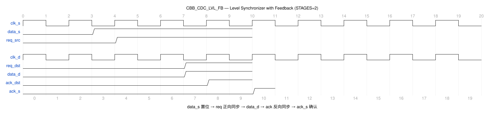

# CBB_CDC_LVL_FB_UG

---

## 目录

- [1. 功能及应用场景](#1-功能及应用场景)
- [2. 规格](#2-规格)
- [3. 方案分析](#3-方案分析)
- [4. 配置参数](#4-配置参数)
- [5. 接口](#5-接口)
- [6. 时序图](#6-时序图)
- [7. PPA](#7-ppa)

---

## 1. 功能及应用场景

`cbb_cdc_lvl_fb` 是一个带反馈确认的电平同步器（Level Synchronizer with Feedback）。将源时钟域的 1-bit 电平信号通过请求-应答（Req-Ack）四相位握手协议可靠地传递到目标时钟域，并通过同步链将应答信号反馈回源端。

**核心功能：**

- 1-bit 电平信号跨时钟域可靠传输
- 四相位握手协议：请求发起、目标响应、应答反馈、请求撤销
- 反馈确认机制：源端收到 `ack_s` 后，才允许下一次电平翻转
- 参数化同步级数 `STAGES`（>=2），适配不同时钟频率比
- 异步复位，复位后所有内部状态清零

**适用场景：**

**信号类型：** 单 bit 电平信号（位宽固定为 1）。带反馈确认机制，仅支持单 bit 信号跨时钟域可靠传输。

**时钟域场景：**
- **慢时钟域 → 快时钟域（推荐）：** 四相位握手周期中，正向同步延迟 = STAGES + 1 个 `clk_d` 周期，反向同步延迟 = STAGES + 1 个 `clk_s` 周期。慢→快场景下反向同步为慢→快方向，`ack_s` 反馈延迟可控。
- **快时钟域 → 慢时钟域（受限）：** 正向同步为快→慢方向，需保证 `data_s` 电平保持时间 ≥ 正向同步延迟 + 反向同步延迟，否则握手可能不完整。建议频率比 f_src/f_dst ≤ 1/(2×STAGES) 以确保可靠握手。
- **完整握手周期：** 一次电平传输总延迟 = (STAGES+1) 个 `clk_d` 周期 + (STAGES+1) 个 `clk_s` 周期。两次 `data_s` 翻转的最小间隔须 ≥ 完整握手周期。
- **最大传输速率：** 受限于双向同步延迟，最大有效传输速率 ≈ 1 / [(STAGES+1)×(1/f_dst + 1/f_src)]。

**典型应用：**
- 关键控制信号的跨时钟域传输（如使能、复位请求）
- 状态标志的可靠同步（如中断标志、错误标志）
- 需"发送-确认"握手的任意 1-bit 信号
- 双时钟域间的状态机同步

---

## 2. 规格

**规格汇总：**

| 规格 ID | 类型 | 规格项 | 描述 |
|---------|------|--------|------|
| DS.CBB_CDC_LVL_FB.INTF.001 | INTF | 双时钟域接口 | clk_s/clk_d 独立时钟域 |
| DS.CBB_CDC_LVL_FB.INTF.002 | INTF | 反馈信号接口 | ack_s（唯一对外反馈确认接口） |
| DS.CBB_CDC_LVL_FB.INTF.003 | INTF | 异步复位接口 | rst_s_n/rst_d_n 低有效复位 |
| DS.CBB_CDC_LVL_FB.CFG.001 | CFG | 同步级数 | STAGES ≥2，默认 2 |
| DS.CBB_CDC_LVL_FB.FUNC.001 | FUNC | 电平同步 | 电平经四相位握手跨域传输 |
| DS.CBB_CDC_LVL_FB.FUNC.002 | FUNC | 反馈保护 | ack_s 有效前忽略新翻转 |
| DS.CBB_CDC_LVL_FB.FUNC.003 | FUNC | 四相位握手 | 请求-采样-应答-释放 |

### 2.1 电平同步与反馈确认 — DS.CBB_CDC_LVL_FB.FUNC.001

源端 `data_s` 变化后，内部请求寄存器置位，请求经同步链传递到目标域，目标域输出 `data_d`，同时生成应答信号反馈回源端。源端收到反馈后清除请求，进入就绪状态。

### 2.2 反馈保护 — DS.CBB_CDC_LVL_FB.FUNC.002

源端只有收到 `ack_s = 1` 之后，才能发起下一次电平翻转。若 `ack_s` 未有效，源端的 `data_s` 翻转将被忽略。这确保目标域已可靠接收当前电平值。

### 2.3 四相位握手协议 — DS.CBB_CDC_LVL_FB.FUNC.003

采用标准的四相位握手协议（4-phase handshake），完整握手周期为：请求置位、目标采样、应答置位、请求清零、目标清零、应答清零。一次完整的电平传输需要经历正向同步+反向同步的双向延迟。

### 2.4 双时钟域接口 — DS.CBB_CDC_LVL_FB.INTF.001

接口包含独立的源域时钟 `clk_s` 和目标域时钟 `clk_d`，支持任意频率比。同步链在目标时钟域运行。

### 2.5 反馈信号接口 — DS.CBB_CDC_LVL_FB.INTF.002

包含正向数据信号 `data_s` / `data_d`，以及一个反向反馈信号 `ack_s`（输出至源域）。仅保留 `ack_s` 作为对外的反馈确认接口，内部应答寄存器 `ack_dst` 不对外暴露。

### 2.6 异步复位接口 — DS.CBB_CDC_LVL_FB.INTF.003

异步复位 `rst_s_n` / `rst_d_n`（低有效），复位时所有内部寄存器清零。源域请求寄存器由 `rst_s_n` 复位，目标域同步链各级寄存器与应答寄存器由 `rst_d_n` 复位。

### 2.7 同步级数可配置 — DS.CBB_CDC_LVL_FB.CFG.001

参数 `STAGES` 配置正向请求同步链与反向应答同步链的寄存器级数，默认值为 2，最小值为 2。更高的级数可降低亚稳态概率，适用于极端频率比场景。输入信号 `data_s` 两次变化之间须保持至少一个完整握手周期（正向 + 反向同步延迟），否则可能漏采或握手不完整。

---

## 3. 方案分析

### 3.1 电路结构

电平反馈同步的核心思想是将 1-bit 电平的翻转信息编码为请求-应答握手协议。源端电平变化时触发请求置位，目标域通过同步链感知请求后将输出信号更新，同时产生应答信号反馈回源端，源端收到应答后清除请求，准备下一次翻转。

**实现方法对比：**

| 方法               | 优点                         | 缺点                               | 选用         |
| ------------------ | ---------------------------- | ---------------------------------- | ------------ |
| 无反馈电平同步     | 结构简单，仅需正向同步链     | 源端无法确认目标域是否接收         | 否           |
| 有反馈电平同步     | 握手确认，可靠性高           | 双向同步链，延迟较长               | **是** |

本设计采用**四相位握手**方案：

1. 源端 `data_s` 翻转时，`req_src` 寄存器置 1
2. `req_src` 经 STAGES 级同步链传递到目标域，成为 `data_d`
3. 目标域 `ack_dst` 跟随 `data_d`，经 STAGES 级同步链反馈回源域，成为 `ack_s`
4. 源端收到 `ack_s = 1` 后，清除 `req_src`，准备接收下一次电平变化

### 3.2 实现方案

**电路结构：**

```
                       ┌─────── 源时钟域 (clk_s) ───────┐
                       │                                   │
  data_s ──────────→ req_src (D-FF) ─┐                │
                       │       ↑         │                 │
                       │       │         ↓                 │
  ack_s ←─────────────── ack_sync REG  │                 │
                       │   (STAGES)       │                │
                       │                 │                 │
                       └─────────────────│─────────────────┘
                                         │
                                         ↓ (跨时钟域)
                                         │
                       ┌─────── 目标时钟域 (clk_d) ──────┐
                       │                 ↓                 │
                       │           req_sync REG (STAGES)   │
                       │                 ↓                 │
                       │           data_d = req_dst ───→ ack_dst (D-FF)
                       │                                   │    │
                       │                                   │    ↓
                       │                                   │  ack_sync → (跨时钟域)
                       └───────────────────────────────────┘
```

**四相位握手表：**

| 阶段 | 事件                   | data_s | req_src | req_dst | ack_dst | ack_s | data_d |
|------|------------------------|------------|---------|---------|---------|---------|------------|
| T0   | 初始状态               | 0          | 0       | 0       | 0       | 0       | 0          |
| T1   | 源端发送请求           | 1          | 1       | 0       | 0       | 0       | 0          |
| T2   | 目标域收到请求         | 1          | 1       | 1       | 0       | 0       | 1          |
| T3   | 目标域发出应答         | 1          | 1       | 1       | 1       | 0       | 1          |
| T4   | 源端收到应答           | 1          | 1       | 1       | 1       | 1       | 1          |
| T5   | 源端撤销请求           | 1          | 0       | 1       | 1       | 1       | 1          |
| T6   | 目标域感知请求撤销     | 1          | 0       | 0       | 1       | 1       | 1          |
| T7   | 目标域撤销应答         | 1          | 0       | 0       | 0       | 1       | 1          |
| T8   | 源端确认应答撤销       | 1          | 0       | 0       | 0       | 0       | 1          |

**工作原理：**

1. **请求置位（T1）**：当 `data_s` 从 0 跳变为 1 时，源时钟域 `req_src` 寄存器在下一个 `clk_s` 上升沿置位为 1。此时 `req_dst`、`ack_dst`、`ack_s` 均保持为 0。

2. **正向同步（T1→T2）**：`req_src` 经 STAGES 级同步寄存器链（在 `clk_d` 域）逐级传递。经过 STAGES 个 `clk_d` 周期后，`req_dst` 变为 1，`data_d` 同步更新为 1。

3. **应答生成（T2→T3）**：目标域 `ack_dst` 寄存器在下一个 `clk_d` 上升沿跟随 `req_dst` 置位为 1。

4. **反向同步（T3→T4）**：`ack_dst` 经 STAGES 级同步寄存器链（在 `clk_s` 域）逐级传递。经过 STAGES 个 `clk_s` 周期后，`ack_s` 变为 1。

5. **请求清除（T4→T5）**：源域检测到 `ack_s = 1` 后，`req_src` 寄存器在下一个 `clk_s` 上升沿清零。

6. **正向传播撤销（T5→T6→T7→T8）**：`req_src` 清零后，`req_dst`、`ack_dst`、`ack_s` 依次清零，完成一次完整的握手周期。

---

## 4. 配置参数

| 参数    | 配置范围 | 默认值 | 描述                                                    |
| ------- | -------- | ------ | ------------------------------------------------------- |
| STAGES  | >= 2     | 2      | 同步寄存器级数。正向请求链与反向应答链使用相同的级数配置 |

---

## 5. 接口

| 信号名      | 位宽 | I/O | 时钟域  | 描述                                     |
| ----------- | ---- | --- | ------- | ---------------------------------------- |
| clk_s     | 1    | I   | src_clk | 源域时钟，上升沿有效                     |
| clk_d     | 1    | I   | dst_clk | 目标域时钟，上升沿有效                   |
| rst_s_n   | 1    | I   | src_clk | 源域异步复位，低有效 |
| init_s_n | 1 | I | src_clk | 源域同步复位，低有效                     |
| rst_d_n   | 1    | I   | dst_clk | 目标域异步复位，低有效 |
| init_d_n | 1 | I | dst_clk | 目标域同步复位，低有效                   |
| data_s  | 1    | I   | src_clk | 源域电平信号，上升沿触发握手请求         |
| data_d  | 1    | O   | dst_clk | 目标域同步后的电平信号，跟随 `req_dst`   |
| ack_s     | 1    | O   | src_clk | 反馈确认信号，高有效，有效时源端可发起下一次传输 |
| test | 1 | I | - | 测试模式使能 |

---

## 6. 时序图

### 6.1 典型时序



- T1: 源端 `data_s` 拉高，`req_src` 置位
- T2: `req_src` 经 STAGES=2 级同步链到达目标域，`data_d` 拉高
- T3: 目标域 `ack_dst` 拉高
- T4: `ack_dst` 经同步链反馈至源域，`ack_s` 拉高
- T5: 源端收到 `ack_s`，`req_src` 清零，完成握手

附加时序说明：
- 正向延迟（`data_s` 变化至 `data_d` 变化）：STAGES + 1 个 `clk_d` 周期
- 反向延迟（`data_d` 变化至 `ack_s` 变化）：STAGES + 1 个 `clk_s` 周期
- 两次 `data_s` 翻转的最小间隔 >= 正向延迟 + 反向延迟

---

## 7. PPA

> **综合工具：** Synopsys DC Ultra W-2024.09-SP3
> **工艺库：** TSMC 12nm tcbn12ffcllbwp7d5t16p96cpd (ssgnp0p9v125c)
> **综合策略：** `compile_ultra -retime -no_seq_output_inversion -no_autoungroup` + 增量编译，时钟周期 0.204ns (4.9GHz)
> **物理约束：** input/output delay = 10% 时钟周期，双时钟域各自约束

### 7.1 参数设置

| 参数   | 设置值           | 说明                   |
| ------ | ---------------- | ---------------------- |
| STAGES | 2                | 2 级同步寄存器链       |
| 工艺   | TSMC 12FFC LL    | 工艺角 ssgnp0p9v125c   |
| 频率   | 4.9 GHz (0.204ns)  | 双时钟域均约束 4.9GHz  |

### 7.2 综合结果

| 项目     | 数值                   |
| -------- | ---------------------- |
| 频率     | 4.9 GHz (0.204ns)      |
| 面积     | 10.690560 µm²          |
| 单元数   | 18 (6 seq / 12 comb / 2 buf-inv) |
| 功耗     | 动态 92.153 µW + 漏电 61.235 nW |
| WNS      | +0.085 ns              |
| 违例路径 | 0                     |

### 7.3 结论

STAGES=2 配置下，TSMC 12nm 工艺库在 0.204ns 周期约束下建立时间无违例（WNS=+0.085ns，0 违例），满足 4.9GHz 双时钟域目标。面积（10.69µm²）和功耗（动态约 92µW）极小，适合资源敏感场景。双向同步链增加了电平传输的延迟（约 4~6 个时钟周期），但换取了传输的可靠确认。

---
