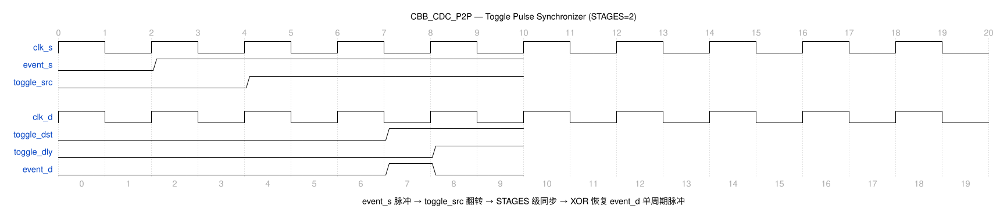

# CBB_CDC_P2P_UG

---

## 目录

- [1. 功能及应用场景](#1-功能及应用场景)
- [2. 规格](#2-规格)
- [3. 方案分析](#3-方案分析)
- [4. 配置参数](#4-配置参数)
- [5. 接口](#5-接口)
- [6. 时序图](#6-时序图)
- [7. PPA](#7-ppa)

---

## 1. 功能及应用场景

cbb_cdc_p2p 是一个点对点脉冲同步器（Point-to-Point Pulse Synchronizer），将源域的**单周期脉冲信号**可靠传递到目标域并恢复为单周期脉冲输出。采用 Toggle（翻转）编码方式，将窄脉冲展宽为电平跳变，经多级同步链传递到目标域后，通过边沿检测恢复出单周期脉冲。

**核心功能：**

- 源域单周期脉冲经 Toggle 编码 → 同步链传递 → 边沿检测 → 目标域单周期脉冲
- 参数化同步级数 STAGES（>=2），适应不同时钟频率比和亚稳态防护需求
- 支持慢到快（默认）与快到慢两种方向，快到慢通过源域脉冲展宽（PULSE_EXT）保证可靠采样
- 仅需 2 个时钟域接口（`clk_s`、`clk_d`），结构简洁
- 支持多种工艺实现（TSMC_12 / FPGA_XILINX / FPGA_ALTERA / RTL 默认）
- 双域异步复位（`rst_s_n` / `rst_d_n`），复位后内部状态清零

**适用场景：**

**信号类型：** 单 bit 脉冲信号（位宽固定为 1）。采用 Toggle 编码-解码机制将源域脉冲展宽为电平跳变后同步，再恢复为目标域脉冲。仅支持单 bit 脉冲信号跨时钟域传输，不适用于多 bit 数据总线或多周期电平信号场景。

**时钟域场景：**
- **慢时钟域 → 快时钟域（SLOW2FAST=1，默认，推荐）：** 源域 `event_s` 单周期脉冲经 Toggle 翻转展宽为电平跳变，同步链在目标域充分采样后通过 XOR 边沿检测恢复为单周期脉冲 `event_d`。同步延迟 = STAGES+1 个 `clk_d` 周期，无需脉冲展宽。
- **快时钟域 → 慢时钟域（SLOW2FAST=0，受限）：** 源域 `event_s` 脉冲经 PULSE_EXT 参数指定的展宽级数扩展为宽脉冲，确保慢速目标域可采样到跳变。展宽宽度 = max(1, PULSE_EXT) 个 `clk_s` 周期。建议频率比 f_src/f_dst ≤ 1/(2×STAGES) 时设置 PULSE_EXT ≥ 2×STAGES 以确保可靠同步。

**设计限制：**
- **最大脉冲速率：** 两次 `event_s` 脉冲的最小间隔须 ≥ max(1, f_src/f_dst × 2×STAGES) 个 `clk_s` 周期，即最大有效脉冲速率 < min(f_src, f_dst/(2×STAGES))。
- 输出 `event_d` 为单周期脉冲，宽度恒为 1 个 `clk_d` 周期。
- 每个 `event_s` 脉冲对应一个 `event_d` 脉冲，不丢失、不重复。

**典型应用：**
- 跨时钟域的单周期使能/触发脉冲传递
- 跨域事件通知
- 状态机跨域触发信号
- 源域脉冲 → 目标域脉冲的一次性事件传递

---

## 2. 规格

**规格汇总：**

| 规格 ID | 类型 | 规格项 | 描述 |
|---------|------|--------|------|
| DS.CBB_CDC_P2P.INTF.001 | INTF | 双时钟域接口 | clk_s/clk_d 独立时钟域 |
| DS.CBB_CDC_P2P.CFG.001 | CFG | 同步级数 | STAGES ≥2，默认 2 |
| DS.CBB_CDC_P2P.CFG.002 | CFG | 工艺选择 | TSMC_12/FPGA_XILINX/FPGA_ALTERA/RTL |
| DS.CBB_CDC_P2P.CFG.003 | CFG | 时钟方向 | SLOW2FAST，1=慢到快（默认），0=快到慢 |
| DS.CBB_CDC_P2P.CFG.004 | CFG | 脉冲展宽 | PULSE_EXT ≥1，默认 4（仅 SLOW2FAST=0 生效） |
| DS.CBB_CDC_P2P.FUNC.001 | FUNC | 脉冲传递 | event_s 单周期脉冲 → event_d 单周期脉冲 |
| DS.CBB_CDC_P2P.FUNC.002 | FUNC | Toggle 展宽恢复 | 脉冲展宽为电平跳变后恢复 |
| DS.CBB_CDC_P2P.PERF.001 | PERF | 亚稳态防护 | MTBF 典型 >10^9 年 |
| DS.CBB_CDC_P2P.PERF.002 | PERF | 最大脉冲速率 | < min(f_src, f_dst/(2·STAGES)) |

### 2.1 脉冲传递 — DS.CBB_CDC_P2P.FUNC.001

源域 `event_s` 的单周期脉冲经 Toggle 编码后传入同步链，目标域通过边沿检测（XOR）恢复为单周期 `event_d` 脉冲。每个 `event_s` 脉冲对应一个 `event_d` 脉冲，不丢失、不重复。

### 2.2 Toggle 展宽与恢复 — DS.CBB_CDC_P2P.FUNC.002

`event_s` 上升沿翻转 toggle_src 的极性（0→1 或 1→0），将窄脉冲展宽为电平跳变。目标域同步链核心级 （`toggle_dst`）与延迟一拍的 `toggle_dly` 异或，在跳变到达时产生一个 `clk_d` 周期的脉冲。

### 2.3 亚稳态防护 — DS.CBB_CDC_P2P.PERF.001

同步链级数 STAGES 决定亚稳态净化深度。STAGES=2 时经过 2 级目标域寄存器净化，MTBF 典型 > 10^9 年（100MHz，TSMC 12nm）。STAGES 越大 MTBF 指数级提升。

### 2.4 最大脉冲速率 — DS.CBB_CDC_P2P.PERF.002

相邻 `event_s` 脉冲的最小间隔受限于同步链延迟及 toggle 编码。源域连续两个同向脉冲需要 toggle_src 经历 0→1→0 两个跳变，目标域需要足够时间完成检测。因此最大连续脉冲速率 < min(f_src, f_dst / (2 x STAGES))。

### 2.5 同步级数可配置 — DS.CBB_CDC_P2P.CFG.001

参数 STAGES 配置同步链寄存器深度，范围 >=2，默认值 2。影响 MTBF（指数级提升）和同步延迟（线性增加）。相邻 `event_s` 脉冲的最小间隔须 ≥ STAGES 个 `clk_d` 周期（确保目标域完成一次边沿检测），否则可能漏采。

### 2.6 工艺宏选择 — DS.CBB_CDC_P2P.CFG.002

通过宏定义选择工艺实现：TSMC_12（12nm 标准 DFF）、FPGA_XILINX（FDCE）、FPGA_ALTERA（dffeas）、无宏（RTL 行为级描述，`reg + always`）。

### 2.7 时钟方向配置 — DS.CBB_CDC_P2P.CFG.003

参数 `SLOW2FAST` 配置时钟域方向：`SLOW2FAST=1` 表示慢时钟域到快时钟域（默认），`toggle_src` 直接由 `event_s` 触发；`SLOW2FAST=0` 表示快时钟域到慢时钟域，源域增加脉冲展宽电路，将窄脉冲展宽后再触发 `toggle_src`，保证慢速目标时钟能可靠采样。

### 2.8 双时钟域接口 — DS.CBB_CDC_P2P.INTF.001

接口包含独立的源域时钟 `clk_s` 和目标域时钟 `clk_d`。`toggle_src` 在源域生成，正向同步链运行在目标时钟域，支持任意频率比。

### 2.9 脉冲展宽配置 — DS.CBB_CDC_P2P.CFG.004

参数 `PULSE_EXT` 配置快→慢模式下的最小展宽脉冲宽度（`clk_s` 周期数），默认 4。源域通过可重触发计数器将相邻的窄脉冲展宽/合并，保证 `toggle_src` 在翻转后至少保持 `PULSE_EXT` 个 `clk_s` 周期，从而满足慢速 `clk_d` 的采样要求。该参数仅在 `SLOW2FAST=0` 时生效。

---

## 3. 方案分析

### 3.1 电路结构

脉冲信号跨时钟域的难点在于，窄脉冲（单 clk_s 周期）可能因时钟相位差被目标域完全错过。简单的电平同步（如 cbb_cdc_lvl）无法可靠传递窄脉冲。解决这一问题的常用方法有两种：

| 方法                 | 优点                       | 缺点                         | 选用         |
| -------------------- | -------------------------- | ---------------------------- | ------------ |
| 电平同步 + 重定时    | 结构简单                   | 窄脉冲会在同步链中被滤除     | 否           |
| Toggle 展宽 + 同步   | 窄脉冲可靠传递、可展宽     | 需要额外编码/解码电路        | **是** |

本设计采用 **Toggle 展宽 + 同步链 + 边沿检测** 方案：

1. 在源时钟域，将窄脉冲（`event_s`）转换为电平翻转（`toggle_src`）。`toggle_src` 会持续保持其极性，直到下一个 `event_s` 再次翻转它。这实际上将窄脉冲"展宽"为跨越多个目标时钟周期的电平信号。
2. 展宽后的电平信号经 STAGES 级同步链（clk_d 域）传递到目标域（`toggle_dst`）。
3. 在目标时钟域，`toggle_dst` 与延迟一拍的 `toggle_dly` 异或（XOR），检测出跳变沿，产生单周期的目标域脉冲（`event_d`）。

### 3.2 实现方案

**电路结构：**

```
  ┌─────── 源时钟域 (clk_s) ───────┐
  │                                   │
  │  event_s ─→ toggle_src (D-FF) ──┼──→ (跨时钟域)
  │      ↑     (在event_s=1时翻转)   │
  │      └── feedback: ~toggle_src     │
  └───────────────────────────────────│─┘
                                      │
  ┌─────── 目标时钟域 (clk_d) ──────┤
  │                                   ↓
  │  toggle_src ─→ sync[0] ─→ sync[1] ─→ ... sync[STAGES-1] = toggle_dst
  │                 (STAGES 级同步寄存器链，级间含亚稳态净化)
  │                                              │
  │                   ┌──────────────────────────┤
  │                   │                          ↓
  │              toggle_dly (D-FF, 1拍延迟)   XOR gate → event_d
  │                                                ↑
  │                                        toggle_dst ^ toggle_dly
  └───────────────────────────────────────────────┘
```

**工作原理：**

1. **Toggle 编码（源域）**：当 `event_s == 1'b1` 时，`toggle_src <= ~toggle_src`。`toggle_src` 从 0 翻转为 1，后续一直保持 1 状态，无论 `event_s` 是否为 0。这让窄脉冲变成了跨越多个 dst 时钟周期的稳定电平。快→慢模式（`SLOW2FAST=0`）下，`event_s` 先经可重触发脉冲展宽电路，将窄脉冲展宽至至少 `PULSE_EXT` 个 `clk_s` 周期，再触发 `toggle_src` 翻转。

2. **正向同步**：`toggle_src` 进入 STAGES 级同步寄存器链（运行在 `clk_d` 域）。每级寄存器消除上一级的亚稳态。经过 STAGES 个 `clk_d` 上升沿后，`toggle_dst = sync[STAGES-1]` 稳定为 `toggle_src` 的最新值。

3. **边沿检测（目标域）**：`toggle_dly` 是 `toggle_dst` 延迟一个 `clk_d` 周期的拷贝。`event_d = toggle_dst XOR toggle_dly`。当 `toggle_dst` 从 0 翻转到 1 时，`toggle_dst = 1, toggle_dly = 0`，XOR 输出高电平，持续一个 `clk_d` 周期直到 `toggle_dly` 也更新为 1。

4. **连续脉冲处理**：下一个 `event_s` 再次翻转 `toggle_src`（从 1 回到 0），重复上述流程。`toggle_dst` 从 1 翻转到 0 时，XOR 再次输出一个单周期脉冲。连续两个同向间隔脉冲之间需确保目标域已完成边沿检测。

**状态转换（源域视角）：**

```
  toggle_src=0                  event_s=1
  [WAIT_PULSE] ──────────────────────────→ toggle_src=1
       ↑                                        │
       │              event_s=1               │
       └────────────────────────────────────────┘
```

---

## 4. 配置参数

| 参数      | 配置范围 | 默认值 | 描述                                       |
| --------- | -------- | ------ | ------------------------------------------ |
| STAGES    | >= 2     | 2      | 同步寄存器级数。影响 MTBF 和同步延迟       |
| SLOW2FAST | 0 / 1    | 1      | 时钟方向：1=慢到快（默认），0=快到慢       |
| PULSE_EXT | 1 ~ 255  | 4      | 快→慢脉冲展宽最小宽度（clk_s 周期），仅 SLOW2FAST=0 生效 |

---

## 5. 接口

| 信号名    | 位宽 | I/O | 时钟域  | 描述                                     |
| --------- | ---- | --- | ------- | ---------------------------------------- |
| clk_s     | 1    | I   | src_clk | 源域时钟，上升沿有效                     |
| rst_s_n   | 1    | I   | src_clk | 源域异步复位，低有效                     |
| init_s_n  | 1    | I   | src_clk | 源域同步复位，低有效                     |
| event_s   | 1    | I   | src_clk | 源域脉冲输入，高有效，单周期脉冲         |
| clk_d     | 1    | I   | dst_clk | 目标域时钟，上升沿有效                   |
| rst_d_n   | 1    | I   | dst_clk | 目标域异步复位，低有效                   |
| init_d_n  | 1    | I   | dst_clk | 目标域同步复位，低有效                   |
| event_d   | 1    | O   | dst_clk | 目标域脉冲输出，高有效，单周期脉冲       |
| test      | 1    | I   | -       | 测试模式使能                             |

---

## 6. 时序图

### 6.1 典型时序



- T0: 源域 `event_s` 产生单周期高脉冲
- T1: 源域 `toggle_src` 翻转（0→1），展宽窄脉冲为持续电平
- T2~T3: `toggle_src` 经 STAGES=2 同步链传递至目标域
- T4: 目标域 `toggle_dst` 跳变为 1，XOR（toggle_dst ^ toggle_dly）产生 `event_d=1`，持续一个 `clk_d` 周期
- T5: `toggle_dly` 更新，`event_d` 恢复为 0

附加时序说明：
- 脉冲延迟 = STAGES + 1 个 `clk_d` 周期（Toggle 编码 0-1 拍 + 同步链 STAGES 拍）
- `event_d` 为组合逻辑输出（`toggle_dst ^ toggle_dly`），时序路径短
- 相邻 `event_s` 最小间隔需保证目标域完成当前脉冲的边沿检测

---

## 7. PPA

> **综合工具：** Synopsys DC Ultra W-2024.09-SP3
> **工艺库：** TSMC 12nm tcbn12ffcllbwp7d5t16p96cpd (ssgnp0p9v125c)
> **综合策略：** `compile_ultra`，时钟周期 0.2ns（5GHz），双时钟域各自约束
> **物理约束：** input/output delay = 0.02ns

### 7.1 配置A：STAGES=2（默认）

**参数设置：**

| 参数   | 设置值           | 说明               |
| ------ | ---------------- | ------------------ |
| STAGES | 2                | 2 级同步寄存器链   |
| 工艺   | TSMC 12FFC LL    | 工艺角 ssgnp0p9v125c |

**PPA 数据：**（DC 综合实测，时钟约束 0.2ns / 5GHz）

| 项目   | 数值                                       |
| ------ | ------------------------------------------ |
| 频率   | 5 GHz                                      |
| 面积   | 5.621760 µm²                               |
| 单元数 | 13 cells                                   |
| 功耗   | 6.2154 µW（动态）+ 30.2821 nW（漏电）      |
| WNS    | >0 ns（双时钟域时序收敛，5GHz 0 违例）      |

**结论：** STAGES=2、TSMC 12nm 工艺下，0.2ns 时钟约束无违例，能满足 5GHz 目标。`event_d`（XOR 组合逻辑输出）时序路径短，频率瓶颈仅在同步链。DC 综合实测 13 个标准单元、面积 5.621760 µm²、动态功耗 6.2154 µW、漏电 30.2821 nW，双时钟域 WNS 均为正，5GHz 时序收敛。

---

